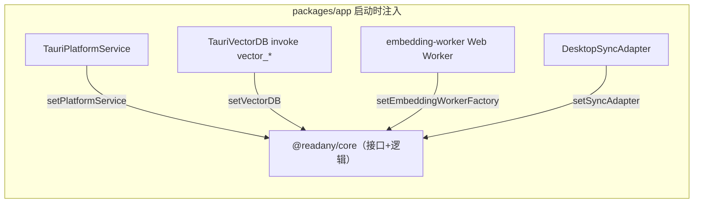

# ReadAny Context

本文件记录经代码核实的事实，帮助 Agent 在本仓库正确工作。不是产品宣传页，不写猜测；没核实的事实进文末「待确认」。事实来源以 `路径:文件` 形式标注，过期就以代码为准并更新本文件。

## 定位与边界

ReadAny：local-first 的多端 AI 电子书阅读器，当前版本 **1.3.6**。五大端/件：

- **桌面**：Tauri 2（`packages/app`，React 19 + Vite 7 + Tailwind 4，Rust 侧 `src-tauri/`）
- **移动**：Expo SDK 54 / React Native 新架构（`packages/app-expo`），阅读引擎跑在 WebView 内嵌的 `reader.html`
- **CLI/MCP**：`@readany/cli`（`packages/cli`），外部 AI 访问书库/笔记/高亮/RAG 的命令行与 MCP server 入口
- **反馈后端**：Cloudflare Worker（`packages/feedback-worker`），App 反馈转 GitHub Issue
- **文档站**：Astro 5 + Starlight（`website`），en(root) + zh 双语，GitHub Pages

格式支持：EPUB/PDF/MOBI/AZW/AZW3/FB2/FBZ/CBZ 原生解析，TXT/UMD 转成 EPUB 后阅读（`packages/core/src/utils/` 下 txt-to-epub/umd-to-epub）。同步后端：WebDAV / S3 / LAN 三选一。LLM provider：OpenAI 兼容系、Anthropic、Gemini、DeepSeek、Ollama 等（union 定义在 `packages/core/src/types/chat.ts` 的 `AIProviderType`）。

本仓库是 `codedogQBY/ReadAny` 的 fork（origin = `Aafff623/ReadAny`）；`AGENTS.md`/`CLAUDE.md`/`CONTEXT.md`/`temp/` 为 fork 本地治理资产，上游没有。

## 领域词汇

| 术语 | 本项目含义 |
|---|---|
| `core` | `packages/core`（`@readany/core`），平台无关业务逻辑层；`main`/`exports` 直指 TS 源码 `src/index.ts`，**无构建产物**，消费方经 Vite/esbuild/Metro 直接编译 |
| 注入（injection） | core 通过接口抽象平台能力，各端启动时注入实现：`setPlatformService`（`IPlatformService`，`packages/core/src/services/platform.ts`）、`setVectorDB`、`setEmbeddingWorkerFactory`、`setSyncAdapter`、`setStreamingFetch`；注入点在 `packages/app/src/main.tsx` 与 `App.tsx` |
| 数据根（data root） | 用户可配置的数据目录，由 `desktop-data-root.json` 指定，TS 与 Rust **双实现**（`packages/core/src/db/db-core.ts`、`packages/app/src-tauri/src/storage.rs`），字段 `dataRoot` 两边必须一致 |
| 双库 | `readany.db`（主库，参与同步）+ `readany_local.db`（本地库），见 `packages/core/src/db/db-core.ts` |
| chunk / provenance | RAG 的文本块存主库 `chunks` 表，向量存 sqlite-vec；`packages/core/src/rag/embedding-provenance.ts` 记录 embedding 模型指纹，模型不匹配会拒绝检索并要求重新向量化 |
| BookDoc | foliate-js 解析产出的统一书籍文档对象，由 `packages/app/src/lib/reader/document-loader.ts` 按格式动态 import 生成 |
| reader.html | 移动端阅读引擎：`packages/app-expo/scripts/build-reader.js` 用 esbuild 把 foliate-js + `core/src/reader` 打包成 IIFE 注入 WebView；是**构建产物，勿手改** |
| parity 契约测试 | 桌面与移动无共享 UI，靠读双方源码做约束的测试（如 `packages/app-expo/src/screens/reader/justified-text-contract.test.ts`、`src/styles/oled-theme-contract.test.ts`） |
| variant | 移动端三变体 development / preview / production（appId `com.readany.app.dev|preview|app`），由 `packages/app-expo/scripts/app-variant.js` 驱动 |
| preflight | `pnpm cli:preflight`：CLI typecheck/test/build + MCP 冒烟 + `cargo test readany_cli::tests`（`packages/cli/scripts/release-preflight.mjs`） |
| skills（两处，勿混） | ① App 内 AI 技能系统（`core/src/ai/tools/` 的 skill-tools + skills 表）；② 项目开发 Skill（`.agents/skills/`） |

## 重要关系

### 包依赖（workspace）

```
packages/app ──┬── @readany/core (workspace:*, TS 源直引)
               └── foliate-js  (workspace:*, vendored fork)
packages/app-expo ── @readany/core (workspace:*，115 个文件直接 import) + 自建 reader.html 打包 foliate-js
packages/cli ────── @readany/core (workspace:*) + better-sqlite3(optional)
packages/feedback-worker / website ── 独立，不依赖 core
LangChain 全家桶 + @huggingface/transformers 是 core 的 peerDependencies，由 app 实际安装
```

### 注入关系（core 定义接口，端上给实现）



### Chat / RAG 链路

- UI（`packages/app/src/components/chat/`）→ `useStreamingChat`（core 的 hook，app 内文件只是 re-export）→ `useChatStore` + `useSettingsStore.aiConfig`（zustand，持久化走 FS JSON `<dataRoot>/readany-store/<key>.json`，不是 localStorage）→ `core/src/ai/streaming.ts` → `core/src/ai/agents/reading-agent.ts`（LangGraph `createReactAgent` 工具循环）→ `core/src/ai/tools/`（rag/library/annotation/analysis/mindmap/skill/context/fallback-content 八类）→ `core/src/ai/llm-provider.ts`（`createChatModelFromEndpoint` 按 provider 分支到 ChatAnthropic / ChatDeepSeek / ChatOpenAI）。
- 混合检索：`core/src/rag/search.ts` = 向量余弦（Rust sqlite-vec，384 维）+ BM25（`core/src/rag/inverted-index.ts` + `tokenizer.ts` CJK bigram）。
- 本地 embedding：Transformers.js 跑在 Web Worker（`core/src/ai/embedding-worker.ts`），内置模型清单 `core/src/ai/builtin-embedding-models.ts`；远程 embedding 走 OpenAI 兼容/Ollama（`core/src/rag/remote-embedding.ts`）。

### 数据层

- SQLite 经 `tauri-plugin-sql` 包成 core 的 `IDatabase`（`execute/select/close`）；无 ORM。
- schema 权威在 `core/src/db/db-core.ts`（内联 CREATE TABLE，16 张表）+ `core/src/db/migrations.ts`（版本号数组，当前 v13）；Rust 侧 `src-tauri/src/db/{mod.rs,schema.rs}` 在 setup 时预建主库。`packages/app/src/lib/db/` 下有**已落后的旧副本**（schema.sql、migrations.ts 只到 v4），仅作参考。
- 写入经 `core/src/db/write-retry.ts` 全局串行化（`runSerializedDbTask`）；连接 PRAGMA：WAL、busy_timeout 15000。
- 向量库是第三个 SQLite（sqlite-vec vec0 虚表），Rust 模块 `src-tauri/src/vector/`，`init_vector_db(handle, 384)` 硬编码 384 维。

### 同步与 TTS

- 同步逻辑全在 `core/src/sync/`：自写 WebDAV 客户端（跑在 `IPlatformService.fetch` 上，三端共用）、S3（@aws-sdk/client-s3）、LAN（桌面 axum server，`src-tauri/src/sync/lan_server.rs`）。模式为整库覆盖 + 表级 `sync_version`/`updated_at`/`sync_tombstones` 合并（`simple-sync.ts`）。WebDAV/S3 密钥存平台 KV（`sync_webdav_password`、`sync_s3_secret_key`）。
- TTS 逻辑全在 `core/src/tts/`：5 种播放器（Browser/Edge/DashScope/OpenAI 兼容/Xiaomi），Edge 走 WebSocket（经 `IPlatformService.createWebSocket` 注入 header）。桌面用 Web Speech + core 播放器；移动用 react-native-track-player 播放，核心逻辑共享、播放器按平台注入。

### CLI 与桌面的桥

`packages/cli` esbuild 构建到 `dist/` → `tauri.conf.json` resources 打包为 `readany-cli/` → Rust `src-tauri/src/readany_cli.rs` 的 `readany_cli_run` command 对外暴露。所以改 CLI 后要让桌面重新打包才生效；`beforeBuildCommand` 会先构建 CLI。

### 版本号

1.3.6 五处一致：`packages/app/package.json`、`packages/app/src-tauri/tauri.conf.json`、`packages/app/src-tauri/Cargo.toml`、`packages/app-expo/package.json`、`packages/app-expo/app.config.js`；统一由根 `scripts/bump-version.js` 管理（`pnpm version:check|version:set`）。`@readany/core` 固定 1.0.0。

## 硬约束

1. **改 core = 三端同时生效**（无构建隔离）；新增文件要补 `packages/core/package.json` 的 `exports` 映射（现有 47 条入口）。
2. 根 `package.json` pnpm overrides 钉死 `react`/`react-dom` 19.1.0、`@types/react` 19.1.17——桌面与移动共用，升级要两端一起验。
3. `.npmrc` 用 `node-linker=hoisted` + public-hoist-pattern（react/metro/babel/pdfjs）——React Native 兼容所需，node_modules 不是默认 pnpm 布局。
4. `patches/` 两个补丁有明确动机：`@langchain__core.patch` 给 `isJsDom()` 的 `navigator.userAgent` 加 typeof 守卫（worker 环境崩溃）；`react-native-track-player@4.1.2.patch` 修 Android `MusicModule` 方法返回签名。升级对应依赖前先读懂补丁是否仍需要。
5. 数据库 schema 只改 core 的 `db-core.ts` + `migrations.ts`，并核对 Rust `src-tauri/src/db/schema.rs` 是否要同步；**不要改** `packages/app/src/lib/db/` 旧副本。
6. `desktop-data-root.json` 的 TS/Rust 双实现必须字段一致。
7. 换非 384 维 embedding 模型需 `vector_reinit`；provenance 指纹不匹配会拒绝检索。
8. 桌面窗口装饰平台差异：macOS Overlay 标题栏 + transparent + macOSPrivateApi（`tauri.conf.json`），Windows/Linux 在 `lib.rs` setup 里 `set_decorations(false)` 自绘——改窗口代码两边都要顾。
9. 桌面端 CSP 为 null、fs scope `**`、http 全开是**设计决定**（自签名 WebDAV 等场景），不是疏漏。
10. Vite 陷阱：`@pdfjs` 别名指向 `packages/foliate-js/vendor/pdfjs`（v4.7，与 foliate 兼容），RAG 用的 `pdfjs-dist` 是另一个 5.x；`foliate-js/pdf.js` 必须在 optimizeDeps.exclude；embedding worker 用 ES 格式；端口 1420 strict。
11. 移动端用 expo-dev-client，不支持 Expo Go；原生依赖/`app.config.js`/权限变更后须重跑 `pnpm expo:ios|expo:android`，日常 JS 调试 `pnpm expo:start`。
12. 桌面 app 无测试配置；测试集中在 core（Vitest 4，81 个文件）+ cli（7）+ app-expo（5，含 2 个契约测试）。
13. fork 保持对上游合并友好：不加 `.github` 模板、不动上游 CI、不重排上游文件格式。

## 已知失败模式

- **Edge TTS 失效**：`core/src/tts/edge-tts.ts` 硬编码 token 与 Chromium 版本常量，微软轮换后会失效，需更新常量。
- **改错 schema 位置**：动了 `packages/app/src/lib/db/migrations.ts`（旧副本，只到 v4）不生效，真正生效的是 core 的迁移链。
- **检索为空/拒绝检索**：先查 provenance（模型指纹）与向量库维度是否匹配，再查 `vector_reinit`。
- **worker 环境崩溃**：`@langchain/core` 补丁就是为此存在；若升级后 worker 崩，先看补丁是否被覆盖。
- **死代码混淆**：`packages/app/src/pages/` 下除 `Skills.tsx` 外均无 import（`Chat.tsx`/`Home.tsx`/`Notes.tsx`/`Reader.tsx`/`Stats.tsx`），react-router 在 package.json 里但未挂载——分析调用链时别把它们当活路径。真实结构是 `App.tsx` 的 Tab 常驻 + `display:none` 切换（reader tab 空闲休眠、切回按 CFI 恢复）。

## 持久化决策（现存文档）

- `docs/stats-design/`、`docs/webdav-import/`、`docs/readany-cli/`（13 篇编号规范 00–12 + `acceptance/`）：上游的功能设计文档集。`docs/` 根下另有 4 篇散篇设计文档：`skills-design.md`（Skill 系统升级）、`sync-design.md`（多后端同步方案）、`system-voice-design.md`（系统语音方案）、`TTS_FOLIATE_NATIVE_MIGRATION.md`（TTS 迁移到 foliate-js 自带 TTS class）。
- `EPUB_CONVERSION_PLAN.md`（仓库根）：格式转 EPUB 技术方案，关键决策为不引入 Pandoc WASM（16MB），基于 foliate-js 解析 + `@zip.js/zip.js` ZipWriter 自建轻量 EPUB Builder，DOCX 新增 mammoth.js。
- `patches/` 两补丁与「桌面端宽松安全配置」决策见上文硬约束 4、9。

## 待确认

- `packages/app/src/pages/` 死代码与 react-router 依赖：上游是否计划恢复路由式页面？清理前需与上游动向对齐。
- `packages/app/src/lib/db/` 旧副本（database.ts/migrations.ts/schema.sql）：是否已无引用可删？
- `.claude/settings.local.json` 被 Git 跟踪且含上游作者的机器路径（`/Users/tuntuntutu/...`）：fork 里是否应 `git rm --cached` 转本地？
- `@readany/core` 固定 1.0.0 不参与版本管理：这是上游策略还是遗漏？（目前跟随即可，不必改。）
